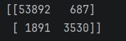

#ch 3 Classification

most common supervised learning tasks are regression and classification,
 this chapter will be about the classification part

In this chapter we use the MNIST dataset, which is a set of 70,000 small images of handwritten digits. Each image is labeled with the digit it represents (0 to 9). The goal is to train a model that can recognize these digits.

#1. Training a Binary Classifier
to simplify we will train a classifier to detect the number 5, this is technically a binary classifier since it will 
either detect 5 or not detect 5, we will use the Stochastic Gradient Descent (SGD) classifier for this task.

we are picking the SDF classifier which stands for Stochastic Gradient Descent, it is a simple and efficient linear classifier that can be used for both regression and classification tasks.

run Classfication.py and see that it works! mostly...

we now need to determine its performance

```python
#determine the model's performance here with cross validation with 3 k folds

    score = cross_val_score(sgd_clf, instance.train_x, instance.train_y, cv=3, scoring='accuracy')
    print(f"Cross Validation Score: {score}")

    #dummy classifier classifies every single image in the most frequent class, which in this case is the negative class (not 5's)
    dummy_clf = DummyClassifier()
    dummy_clf.fit(instance.train_x, y_train_fives)
    print(any(dummy_clf.predict(instance.test_x))) #should print false: no 5's detected


    #should print around 90% since 10% of the images are 5's and the other 90% are not, so if you were to guess if an image is not 5, you would be
    # right around 90% of the time
    print(cross_val_score(dummy_clf, instance.train_x, y_train_fives, cv=5, scoring='accuracy'))
```

this demonstrates why accuracy is generally not the preferred performance measure
for classifiers, especially when you are dealing with imbalanced datasets (datasets where some classes are much more frequent than others). In this case, the dummy classifier achieves a high accuracy by simply predicting the most frequent class, which is not a good model for detecting 5's.

A better way to evaluate the performance of a classifier is to look at the confusion matrix, which shows the number of true positives, true negatives, false positives, and false negatives. This allows you to see how well the classifier is doing in terms of correctly identifying 5's and not misclassifying other digits as 5's.

The general idea of a confusion matrix is as follows:
1. Count the number of times instances of class A are classified as class B, for all A/B pairs.
2. To know the number of times the classifier confused images of 8's wit 0s, you would look at row #8 column 0 of the matrix

To compute a confusion matrix, you need to have a set of predictions so that they can be 
compared to the actual targets.

```python
# we can use the cross_val_predict() function to get the predictions for each instance in the training set, using cross-validation. This way, we can get a more realistic estimate of the model's performance.
 #using a confusion matrix and cross_val_predict
    y_train_pred = cross_val_predict(sgd_clf, instance.train_x, y_train_fives, cv=3)

    #just like the cross_val_score() function, this one performs k-fold cross-validation, but instead of returning the evaluation scores
    #it returns the predictions made on each test fold.

    cm = confusion_matrix(y_train_fives, y_train_pred)
    print(cm) #each row represents an actual class, while each column represents a predicted class.
 ```

53,892 were correctly classified as not 5's (true negatives), 687 were incorrectly classified as 5's (false positives), 1,891 were incorrectly classified as not 5's (false negatives), and 3530 were correctly classified as 5's (true positives).